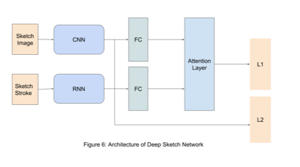

# Deep Sketch Network for Million-scale Sketch Recognition
This Deep Sketch Network(DSN) is implemented with Pytorch to recognize sketch drawing. It is an experimental game in a playful way to show how AI works. The dataset includes 50M+ sketch drawings and 340 categories. Each category includes 15K ~ 20K drawings. Advancing on the sketch recognition could greatly help OCR, ASR and NLP. 

In order to draw other things than cats, you will find more drawing data here: https://github.com/googlecreativelab/quickdraw-dataset

architecture:

renet.py: It includes resnet model
QDdata.py: It will create the pixel image on the fly.

# How to create dataset
* run preprocess_data

# How to train DSN
* run all the section untill resnet50 96X96
* run Deep Sketch Network

Refernces:
1)A Neural Representation of Sketch Drawings - https://arxiv.org/abs/1704.03477

2)SketchMate: Deep Hashing for Million-Scale Human Sketch Retrieval - https://arxiv.org/abs/1804.01401
